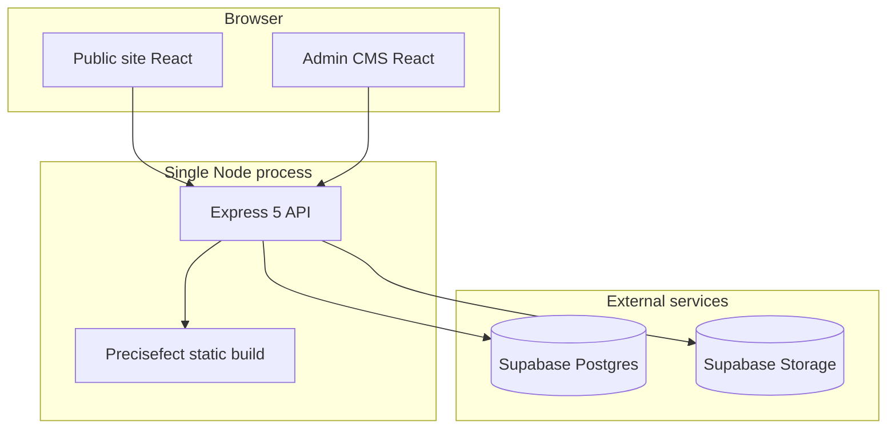

# PreciseFect Solution Pvt Ltd

Monorepo for the **Precisefect** marketing website and headless CMS — a B2B consulting brand focused on **ERP implementation** and **business automation** (“Precision + Perfection”).

This is **not** an ERP product. It is the agency’s **public site + content platform**: pages, blog, case studies, careers, admin console, and deployment tooling.

**Target audience:** SMEs and enterprises evaluating ERP/automation partners (manufacturing, retail, logistics, pharma, professional services).

---

## Architecture



**Production:** One Node process (`server.mjs`) serves the REST API under `/api` and the built React app as static files. Hostinger deployment is supported via PM2 (`ecosystem.config.cjs`) and CI-built artifacts.

---

## Repository structure

| Package / area | Role |
|----------------|------|
| `artifacts/precisefect` | Main public website + embedded admin UI |
| `artifacts/api-server` | Express backend, auth, CRUD, sitemap, assets |
| `artifacts/mockup-sandbox` | Separate Vite app for UI/mockup experiments |
| `lib/db` | Drizzle ORM schemas + Postgres access |
| `lib/api-spec` | OpenAPI spec (health; most routes are hand-rolled) |
| `lib/api-zod` / `lib/api-client-react` | Generated types/clients |
| `scripts` | Production build, CMS seed scripts, Hostinger helpers |

**Package manager:** pnpm workspaces  
**Language:** TypeScript

---

## Technology stack

| Layer | Technologies |
|-------|----------------|
| Frontend | React 19, Vite 7, Wouter, TanStack Query, Tailwind CSS 4, Radix/shadcn UI, Framer Motion, react-hook-form, Zod |
| Backend | Express 5, Pino, cookie sessions, Zod |
| Database | PostgreSQL (Supabase), Drizzle ORM |
| Media | Supabase Storage (`cms-assets` bucket) |
| Auth | Single admin password → HTTP-only session cookie |
| CI/CD | GitHub Actions (typecheck + build; Hostinger artifacts on `main`) |

---

## Public website

### Routes

| Path | Purpose |
|------|---------|
| `/` | Homepage |
| `/about` | Company profile |
| `/services`, `/services/erp`, `/services/automation` | Service offerings |
| `/industries` | Vertical expertise |
| `/case-studies` | Client proof / outcomes |
| `/pricing` | Engagement models |
| `/blog`, `/blog/:slug` | Content marketing |
| `/faq` | Prospect FAQs |
| `/careers` | Job openings |
| `/contact` | RFP / consultation form |
| `/p/:slug` | CMS-driven custom landing pages |
| `/admin/*` | Password-protected CMS |

### Features

- Premium B2B design with global navbar CTA → `/contact`
- **WhatsApp widget** (phone + prefilled message from site settings)
- **Contact info:** `info@precisefect.com`, `+91 6353564970`, Ahmedabad
- Per-page SEO (meta, OG, GA4, Search Console from settings)
- **Sitemap** and **robots.txt** from the API

Built-in page copy defaults live in `artifacts/precisefect/src/lib/site-page-registry.ts` and can be overridden in the admin **All Pages** editor.

---

## Admin CMS (`/admin`)

Login with `ADMIN_PASSWORD`. The dashboard manages:

### Content collections

| Collection | Use |
|------------|-----|
| Blog posts | Articles with publish/schedule |
| Case studies | Problem / solution / metrics |
| FAQs | Ordered Q&A |
| Team members | About page team |
| Job openings | Careers (optional external `applyUrl`) |
| Testimonials | Client quotes |

### Site management

| Tool | Use |
|------|-----|
| Navigation & footer | Navbar links, CTA, footer columns |
| All pages | Built-in routes + custom `/p/slug` pages |
| SEO management | Per-path meta overrides |
| Site settings | WhatsApp, GA4, Search Console, canonical `siteUrl` |

### CMS capabilities

- Publish / draft and scheduled publish (`publishedAt`)
- Content revisions (audit trail)
- Asset uploads to Supabase Storage
- Custom pages with layouts and hero CTAs

---

## API (`/api`)

| Area | Endpoints (summary) |
|------|---------------------|
| Health | `GET /healthz` |
| Auth | `POST /auth/login`, `POST /auth/logout`, `GET /auth/me` |
| Collections | CRUD: blog, case studies, FAQs, team, jobs, testimonials, custom pages |
| Site pages | `GET/PUT /site-pages/content` |
| Site blocks | `GET/PUT /site-blocks/:type` |
| Settings | `GET /settings`, `PUT /settings/:key` (admin) |
| SEO | `GET /seo`, `GET /seo/all`, `PUT /seo` |
| Assets | `GET/POST/DELETE /assets` (admin) |
| Revisions | `GET /revisions`, `GET /revisions/:id` (admin) |
| Discovery | `GET /sitemap.xml`, `GET /robots.txt` |

Public reads return **published** content only; writes require an admin session.

---

## Database

Postgres via Drizzle (`lib/db`). **No lead/contact tables** — schema is CMS-only:

- `blog_posts`, `case_studies`, `faqs`, `team_members`, `job_openings`, `testimonials`
- `custom_pages`, `site_pages`, `site_blocks`, `site_settings`, `seo_pages`
- `assets`, `content_revisions`

---

## Lead capture (current status)

| Channel | Behavior |
|---------|----------|
| Contact form (`/contact`) | Client-side validation only; shows success UI but **does not persist or email leads** |
| WhatsApp widget | Opens external chat; not logged in CMS |
| Email / phone | Direct `mailto:` / `tel:` links |

A backend lead pipeline (CRM, email notifications) is **not implemented** yet.

---

## Getting started

### Prerequisites

- Node.js 22+
- pnpm 11+
- Supabase project (Postgres + Storage)

### Setup

```bash
cp .env.example .env
# Fill in DATABASE_URL, SESSION_SECRET, ADMIN_PASSWORD, Supabase keys

pnpm install
pnpm --filter @workspace/db run push   # apply schema (if needed)

# Optional: seed defaults
pnpm --filter @workspace/scripts exec tsx src/seed-settings.ts
pnpm --filter @workspace/scripts exec tsx src/seed-cms.ts
```

### Development

```bash
# Terminal 1 — API (default :8080)
pnpm --filter @workspace/api-server run dev

# Terminal 2 — Vite frontend (default :5173, proxies /api)
pnpm --filter @workspace/precisefect run dev
```

Open `http://localhost:5173`. Admin: `http://localhost:5173/admin`.

### Production build

```bash
pnpm run build:prod
pnpm start
```

Serves API + static site on `PORT` (default `3000` via `server.mjs`).

---

## Environment variables

See `.env.example`. Main variables:

| Variable | Purpose |
|----------|---------|
| `DATABASE_URL` | Postgres connection (Supabase) |
| `DATABASE_DIRECT_URL` | Optional direct URL for Drizzle push |
| `SESSION_SECRET` | Admin session signing |
| `ADMIN_PASSWORD` | CMS login password |
| `SUPABASE_URL`, `SUPABASE_SERVICE_ROLE_KEY`, `SUPABASE_STORAGE_BUCKET` | Media uploads |
| `PORT`, `BASE_PATH`, `STATIC_ROOT` | Server / static paths |
| `VITE_DEV_API_PROXY` | Vite dev proxy to API |

---

## Scripts

| Command | Description |
|---------|-------------|
| `pnpm install` | Install workspace dependencies |
| `pnpm build` | Typecheck + build all packages |
| `pnpm run build:prod` | Production bundle for Hostinger |
| `pnpm start` | Run `server.mjs` (API + static) |
| `pnpm run typecheck` | Typecheck libs + artifacts |

---

## Deployment

- **Entry:** `server.mjs` at repo root
- **PM2:** `ecosystem.config.cjs` (`precisefect` app, port 3000)
- **CI:** `.github/workflows/ci.yml` — typecheck/build; commits `artifacts/*/dist` for Hostinger on push to `main`

### Production database (leads / CRM)

After pulling leads or CRM changes, apply schema to the **same Postgres** your Hostinger `DATABASE_URL` uses:

```bash
# Prefer direct port 5432 for migrations (see .env.example DATABASE_DIRECT_URL)
pnpm --filter @workspace/db run push
```

Or run the SQL files in `lib/db/migrations/` in order (`0001` → `0005`) in the Supabase SQL editor, or paste **`lib/db/migrations/production-leads-bundle.sql`** (leads + CRM + permissions; requires `users` / `module_registry` from `0001`).

From your machine (uses `.env` `DATABASE_URL` / `DATABASE_DIRECT_URL`):

```bash
pnpm run db:migrate
```

Then seed permissions and roles (once per environment):

```bash
pnpm --filter @workspace/scripts exec tsx src/seed-foundation.ts
pnpm --filter @workspace/scripts exec tsx src/seed-phase3.ts
```

Without the `leads` table (and `score` / `score_breakdown` columns), `POST /api/leads` and admin **Add lead** return HTTP 500.

---

## What's complete vs planned

### Delivered

- Full marketing site (12+ page types)
- Headless CMS with collections, page editor, SEO, nav/footer, media
- Express API + Postgres + Supabase storage
- Admin auth, revisions, scheduled publishing
- Sitemap, analytics hooks, WhatsApp widget
- Monorepo, CI, Hostinger production pipeline

### Not yet built

- Real lead capture (form → API → CRM/email)
- CRM integration
- Lead inbox in admin
- Careers open-application form handler
- Newsletter / marketing automation

---

## License

MIT
